# Stylus
**An analog audio recording and track generating tool**

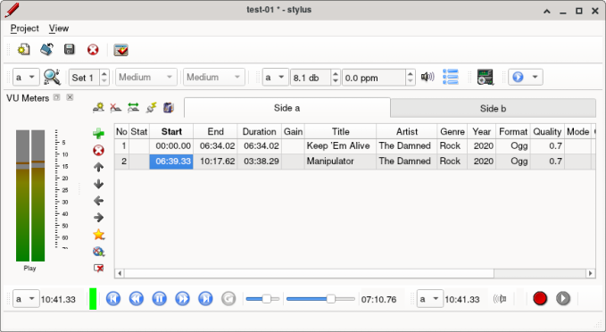

Stylus helps you in digitizing music stored on vinyl records or compact cassettes.
It records each side of your records in one go to a single dedicated file. A track detector (semi-) automates finding start and end of each track. A front end to Music Brainz fetches meta data about about artist, album and tracks. Meta data can be entered manually as well. Stylus will optimize the volume level of the recording. Finally it will create tagged output files in mp3, vorbis ogg or flac format for each individual file. Optionally it pushes them directly to a dedicated directory, e.g. your home media server.

Stylus is not an advanced audio processing tool. It can't perform noise reduction, click removing etc. It is also not a DAW or Audacity like program.
For now it runs only on linux.
## Building
make sure to have the following libraries installed:

    qt6-base libFLAC libvorbisenc libmp3lame libasound libid3tag libvorbis libogg libmusicbrainz5
    
Stylus has no config file yet, so you need to modify the file stylus_paths.h before building. Edit the following:  

- LOCAL_BASE_PATH this is the path to the root of the projects. Temporary data is stored here.
- REMOTE_BASE_PATH this is the folder where the final files (i.e. individual mp3) go. It can be the exposed and mounted tree of your media server, but of course also a folder on your local machine.

Now you can do the actual build with

    qmake && make
and finally install with

    sudo make install

## Use
**Remember the fact that each tool will operate against the side shown in the 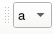 dropdown box. The tools are independent, so they may have set different sides set. When you finish work on tool A and go ahead to tool B, ensure it is set to the correct side. The sync mode 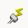 may be helpful to avoid this.**    

The typical workflow looks like this:  
* [Create a new project](#create-a-new-project) 
* [Save settings](#save-your-settings)
* [Record the album](#record-the-album)
  * [Record the first side](#record-the-first-side)  
  * [Listen to the recorded audio](#listen-to-the-recorded-audio)  
  * [Play back the recorded file](#play-back-the-recorded-file)
  * [Flip the vinyl and record the other side](flip-the-vinyl-and-record-the-other-side)
* [Populate the track list](#populate-the-track-list)
  * [Type in tracks](#populate-the-track-list-manually) or
  * [Query music brainz database](#fetch-track-data-from-music-brainz-databse)
* [Generate output files](#generate-output-files) 
  

### Create a new project
Click the "New" button and fill in the form. The **project settings** are mandatory and can't be changed later. The *Name* can be arbitrary text, but *Artist* and *Album* shall be spelled as written on the record. You may modify the *work path* after entering Artist and Album.     
The **target defaults** fields set the type of output files and how they are tagged and commented. You may set them at a later stage. After closing the dialog, you should

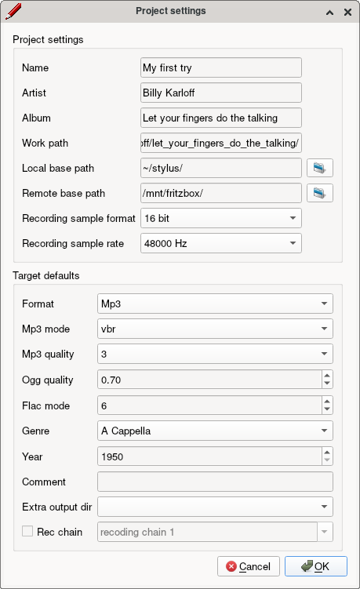

### Save your settings
Use the FIXME button to save changes to the project file. Press the button also after values in the track editor have changed.
### Record the album
Set up your audio so that both a stereo playback and a stereo recording stream is presented to stylus. Make sure that your phono preamp is the one and only audio source. Check your audio mixer settings. On problems, consult settings of other audio programs like audacity for reference.
### Record the first side
Double click on one of the bars of the VU meter and repeat until there is a bar pair for playback and record. Widen the meter window a bit so that the dbfs units are visible:  
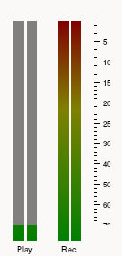  
Prepare for recording the first side (a):  
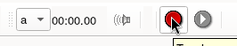  
The stream is now ready to go, as indicated by the active go / stop button.
Start recording by pressing the go / stop button:  
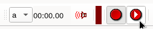  
Recording time will start rolling and the Rec VU meter will show average as well as peak levels. Adapt your audio chain gain to reach a reasonable recording VU level. You should never see the peak bars dropping off of the top. Don't worry about too low volume in the output mp3. The level will be increased later using the normalisation tool.  
### Listen to the recorded audio
Press the *play current recording* 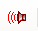 button. Stylus will play back the audio from the file it is currently recording. There is no time gap between played and recorded audio, the play stream time position is euqal to that of the recorded stream.   
### Play back the recorded file
Use the 
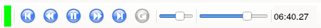
play tool. It consists of well known controls. The small slider sets playback volume and the large one playback position. A bit special is the "Update length" button. When recording and playing the same side, it will imbue the length of the recorded stream to the playback stream *once*. The playback file is assumed to contain a finite chunk of music, despite the still growing file. As a consequence, setting the time slider to certain positions will cue always to the same point of time unless you press the update button again.
### Flip the vinyl and record the other side
Most toolbars contain a dropdown side selector . The shown letter indicates against which side the tool is operating. So recording vinyl side b is nothing more than activating side b in the record toolbar, activate the stream and start recording like above.  
The tool's active sides are independent by default. This allows for e.g. recoding side b and playing pack side a at the same time. This behavior can be changed using the  sync switch. If active, switching sides on the track editor will also change the toolbars' active side. This is useful when working off side after side.  
### Populate the track list
The track editor presents track data in table view. Each side has a tab assigned to it. You can manually modify the cell content by double clicking on it. Track related mistakes can be corrected using the 'Move track...' buttons.
### Populate the track list manually
To manually add tracks to the list, use the track editor's tools 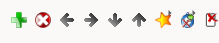. It is essentially clicking  multiple times, entering the track name in each cell, and finally let stylus fill in additional information by pressing  . 
### Fetch track data from Music Brainz databse
To avoid typing in track data, consult the music brainz database. Press 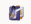 to open the dialog. Stylus aims to fetch artist, album 
and tracks in one go. But it will stop and wait for user action in case of no or ambiguous matches. You start the lookup by pressing the topmost gears button. Watch the dialog's status bar  
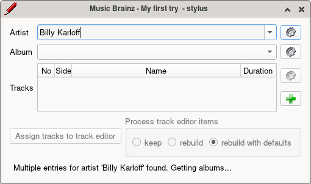,  
it may give additional information. It turns out that there are multiple entries for the artist. So we have to select the right one. Once the ambiguity is resolved, we continue  and continue the search by clicking the "Get Album" button. The is (kind of) unique, so stylus can continue and fetch also the tracks:  
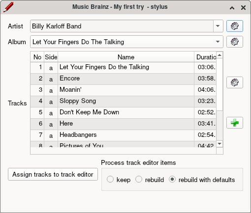  
We got all of them, but as a single list where tracks have no association to the vinyl sides yet.
To fix it, double click into the cell that crosses the proper row and the  'Side' column. Stylus then assings the next side from this row downwards. Repeat accordingly for multi disc packages. Close the music brainz dialog. Now that we have the song names ready, we can
### Segregate tracks
There is two ways to do so. You can
### Segregate tracks manually
The 'listen and click' style comes in handy if you want to to listen to the full record anyway and aren't away from your computer. While playing back, you just press the detector's action button. Stylus will interpret your action as start of the first track, end of current & begin of new track, or last track, respectively. If you missed a transition and did not press the button, you can easily catch up by cueing back in the play tool. To enter this mode, change from find mode  by keeping the action button pressed and selecting 'Manual split without pause'  from the context menu. A more convenient way is to
### Segregate tracks using the track detector
Enable this mode by changing the button action to . Stylus tries to detect all tracks automatically. It produces one or more result sets. The first one is immediately applied to the tracks, so you see all songs fitted with start and end times.  
You should verify that they are correct by double clicking into the Start and End cells of the track editor. If they don't mach well, switch to the next result set using . Differences within multiple sets may vary very little, or by a lot. Use the mouse wheel to switch between them and watch changes in the track editor.  
  
You can trim time points manually. Select the cell of the start / end / duration of the track in question and use the mouse wheel to increase or decrease. Additionally push left or right mouse button to change the stride. With the audio playing, stylus cues to immediately to the new position.
### Normalize volume level 

Stylus can normalize the volume of the recorded audio. Normalized the output files contain music at the highest possible level. Played back, the audio is as loud as possible without distortion. This is achived by plain scaling. All samples of each side are increased in amplitude by some value. Dynamic compression is not applied. Upon selecting the active sind, the normalizer tool bar  
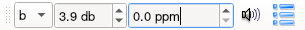  
sets the level to the undistorted max. It reads: "Volume of side b can be increased by 3.9 db. You will get zero distorted samples". Going beyond the given gain results in truncated samples. The ppm spin box tells the share in parts per million, based on the sample count of the entire recorded side. You can also change the ppm in the spin box, then the according level is calulated. Pushing the gain too far will produce audible distortion. Press the loadspeaker button to apply the current level to played back audio. It does not affect created output files. Finally press the Commit button to assign the level to each track. You still can change the level per track by double clicking into the Gain column of the track editor. 
### Generate output files
Before starting the build, keep the writer button 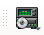 pressed. A menu pops up  
  
Select the items you want. Most often you'll just check also the 'create remote' tick. Then the output files will be written not only to your local (work) directory, but also to the remote base path you provided with the [Create a new project](#create-a-new-project) step (you still could change it at this stage using the 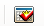 button from the main menu bar. 
